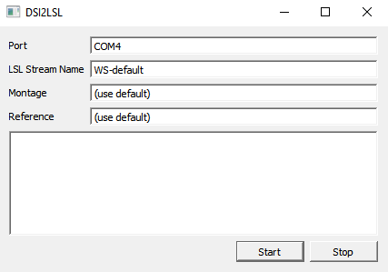

# Wearable Sensing LSL (dsi2lsl) 

This application supports several dry/wireless EEG headsets made by [Wearable Sensing](http://www.wearablesensing.com).

You can find prebuilt binaries for Windows, Linux, and Mac OS on the Releases
page of this repository. For build instructions, see section [Building From Source](#building-dsi2lsl-from-source) below.

*Note*: The program has been tested with the DSI-7 and the DSI-VR300 headsets, 
but several other headset models should work, as well.

## Usage

To use this software, you do __not__ need the *DSI-Streamer* program, although it is
helpful to have at hand during headset setup (e.g., for checking impedances or
for troubleshooting).

Your headset, which is a Bluetooth device, has to be paired with your machine 
in order to use it with dsi2lsl. The recommended procedure is to follow the 
vendor instructions for this, which are different for the respective operating 
systems. 

To check that your
headset is correctly paired, run the *DSI-Streamer* application by Wearable Sensing 
and make sure that it can receive data (if it can not, dsi2lsl will also not work).
Note the port name that this program uses, which differs between OSes and machines
(e.g., it might be `COM4` on a Windows, but it could also be a much higher
port number if you work a lot with COM-port devices). The section
[Bluetooth Quick Reference](#bluetooth-quick-reference) 
below has some additional information on pairing and looking up the port name.
 
### Using The Graphical User Interface (GUI)
 
Now that your headset is paired, and you have the port name, you can use 
either the command-line interface or the graphical user interface. To use the 
GUI, launch the program dsi2lslgui, which should open a window like this:



When filling in information, be sure to review the tooltips of the various
entry fields by hovering over them with the mouse.

The only setting that you __must__ specify is the Port field, which defaults to blank.
Be sure to put here the correct port name. Follow the vendor's information on
how to retrieve this, or fall back to the [Bluetooth Quick Reference](#bluetooth-quick-reference)
section below. In short, on Windows this is typically a string like, e.g., `COM7`,
on Linux it is a device name such as `/dev/rfcomm0`, and on Mac OS, it is
a device name like `/dev/tty.DSI7-017-BluetoothSeria`.

You can change the LSL Stream Name field freely, but this is not necessary for
correct operation. The stream name will be recorded to a file if you use the 
Lab Recorder, so be aware to enter no personally identifiable information. Typically
one would enter the device name, or if you have multiple devices of the same type,
append a number or other unique identifier.

Next, you can override the montage. The default "(use default)" is to record from all electrodes
and to use the reference that is available on the hardware (e.g., ear or mastoid, 
etc.) as documented in your device manual. To override this, you use a syntax that is 
interpreted by the headset software, and so, so for the most detailed information, 
you can consult your vendor-provided documentation. In general, this entry field
 ust be specified without any space characters. In the simplest case, this
is just a comma-separated list of channel names, e.g., `C3,C4,P3,P4`. However, 
you can also define differential channels, for example
`F3,C3-F3,C4-CF`, or even scaled versions of channels, for example 
`F3,C3-F3,C4-F4,Pz-P3/2-P4/2`. The special channel name `TRG` refers to the 
trigger channel, if you use that (most users would likely rely instead on native 
LSL events from their stimulus presentation program instead). 

The reference option follows essentially the same syntax, and you could, for example,
set `C3/2+C4/2` here, which will cause the average of these two channels to be 
subtracted from all other channels, or use the special names `A1` and `A2` (ears), 
or `M1` and `M2` (mastoids), if these leads are present on your device.

The last box is not an edit field but the console output when the program is 
running. To start data acquisition, assuming your headset is ready, click the
Start button, and to stop it again, use the Stop button. When data acquisition
is running the program will show a progress bar in the bottom section of the 
window. If any errors or warnings are generated by the DSI API, you will see 
these listed in the console (some bening messages may also appear there). You 
can get additional information from your vendor on what these error messages 
mean and how to remediate them.


#### Troubleshooting

Occasionally you may get diagnostic messages about some packets CRC checks or 
etc having failed, and from what we can tell, this is not uncommon with Bluetooth, 
especially at greater distances to the bluetooth dongle or with a lot of background
interference. Data acquisition will continue despite these messages. If this
is very frequent, you may check with the vendor to make sure that you are have
the optimal Bluetooth setup.

If the underyling driver program crashes, you will see that the animated 
status bar disappears, which is a way to quickly confirm whether acquisition is
still running or not. 

Note that, when you get an fatal error at startup, you will see the help text
of the `dsi2lsl` program (which is the actual workhorse behind
the GUI) in the console, and to see the error that caused it, you have to scroll 
up above that help text. 

In general we recommend first trying the DSI-Streamer to make sure that it is
receiving data. This will also tell you the names of the channels on the headset
and the names of the reference channels, in case you want to override it.
Then try the simplest setting in `dsi2lsl` that can work (i.e., leave everything 
other than the port unspecified).

The most common cause of errors is that the port is either incorrect, or not
specified, or that the headset is not paired, or not in the right state (e.g.,
not discoverable). Other common errors are using a channel name that does not
exist on the headset in the montage or reference listing. To retry connecting 
after an error, it is best to turn the headset off (6-second press on the power 
button), and then back on and into pairing mode. 

You may also get a spurious error about your chosen com port not being available, 
even though it worked previously. In this case, it is possible that either you 
have the DSI-Streamer running, or two instances of `dsi2lsl`, or the program may 
not have shut down correctly (you can press Stop again or close and reopen the 
GUI to be 100% sure). This is because the DSI's COM port cannot be shared 
between two applications.


#### Bluetooth Quick Reference

Note that this information should only be considered supplementary -- if these
instructions do not work for you, check with your vendor for the latest 
information on how to pair the device with your OS.

Make sure that your headset is in discoverable mode (LED blinking blue); refer
the device manual for that.

##### Windows 10 (1836)

Navigate to the "Bluetooth & other devices" settings screen (e.g., by right-clicking
the bluetooth icon in your status bar and selecting Show Bluetooth Devices).

Check if the device is already listed (it may not be reported under the exact
same name as the headset model, e.g., a DSI-VR300 might report as DK1-0006) and
has "Paired" written under it. If it is not, go to "Add Bluetooth or other
devices", select Bluetooth, and then wait for the device to show up. If you are
not sure what is what, try with the headset turned off to get a list of other
devices, and then turn on pairing on the headset. You should now see another
device appear.

Once you have your headset added, which should now show as paired, go to 
"More Bluetooth options", and under COM Ports, you should see the ports
assigned to each device, including the headset. Note the name of the outgoing
port (which will often be the lower port number). Also be sure to include the
full spelling, e.g., COM4 (you need to enter this in the software).

##### Linux (Ubuntu)

On Ubuntu, open a terminal and enter the following to install the bluetooth
package if it is not yet present: 

```bash
sudo apt-get install bluez bluez-tools
```

Now, list all the devices that are present on the system using hcitool. 

``` bash
hcitool scan
```

Note the xx:xx:xx:xx:xx:xx device address, and use it in the following command
to bind it to `/dev/rfcomm0`, or a different device number if you have multiple
bluetooth adapters in your machine.

``` bash
rfcomm bind /dev/rfcomm0 xx:xx:xx:xx:xx:xx 1
```

The `/dev/rfcomm0` here is the device name that should later be passed to the 
dsi2lsl application.


##### Mac OS

First, add the DSI device through the Bluetooth manager.
 
Nex, find the port using the following command, and look for a device that seems
to match your headset model name.

```bash
cd /dev
ls -l tty.*
```
      
For us this returned `/dev/tty.DSI7-017-BluetoothSeria`. This name is what you
would pass into the dsi2lsl application as the port name.

# Usage (CLI)

The app runs in the same way on the three platforms. Below we illustrate the 
different options that can be used. With the exception of the option --help, all 
the others should be given in --NAME=VALUE format. Use a terminal to run the 
examples.

Notes:
* Linux users: since the app uses the serial port to exchange data with the 
  device, your account may need to have superuser privileges (use sudo before 
  any command).
* Linux and Mac users may need to add the path the the folder containing the 
  binary and libraries to the system library path, if so use the following command
      
``` bash
export LD_LIBRARY_PATH=/your/path/to/CLI:$LD_LIBRARY_PATH
```

### --port
Specify the serial port with the --port option. If not specified, the API will 
look for an environment variable called `DSISerialPort`. This example uses the 
serial port that the device is binded to on GNU/Linux, for other platforms see 
the previous secton.

``` bash
./dsi2lsl --port=/dev/rfcomm0
```

### --lsl-stream
Specify the name of the LSL stream on the network. If omitted, the default name 
`WS-default` will be used

``` bash
./dsi2lsl --port=/dev/rfcomm0 --lsl-stream-name=mystream
```

### --montage 
Specify the montage, a list of channel specifications, comma-separated without 
spaces, (can also be space-delimited, but then you would need to enclose the 
option in quotes on the command-line). If omitted all available channels will be
used. You can also use expressions such as `F3-F4` for differential channels,
as well as, e.g., `C3/2+C4/2` to average the signal from 
two or more leads into a channel. 

``` bash
./dsi2lsl --port=/dev/rfcomm0 --lsl-stream-name=mystream --montage=F3,C3,P3,P4,C4,F4,Pz
```

### --reference
Specify the reference, the name of sensor (or linear combination of sensors, 
without spaces) to be used as reference. Defaults to a \"traditional\" 
averaged-ears or averaged-mastoids reference if available, or the factory 
reference (typically Pz) if these sensors are not available.

``` bash
./dsi2lsl --port=/dev/rfcomm0 --lsl-stream-name=mystream --montage=F3,C3,P3,P4,C4,F4,Pz --reference Pz
```


# Building dsi2lsl From Source

### All Operating Systems

Before you can build this software, you currently have to download the SDK 
binaries and headers for the device. The are available [here](https://wearablesensing.com/files/DSI-API_Current.zip).
These binaries are only needed to build the `dsi2lsl` program (the `dsi2lslgui` 
GUI application is a separate program that launches the former).

Also make sure that you have downloaded the liblsl.dll, .so, or .dylib for your 
operating system (which you can find side by side with the application binaries
on the Releases page). Again, these binaries are only needed by the `dsi2lsl` 
program, and should go, together with the SDK files, into the `CLI` folder.

### GNU/Linux

Open a terminal and navigate to the CLI/ folder.

```bash
cd /your/path/to/CLI
```

Compile the project using GCC (be sure you have the gcc package installed on
your system). Note that this command assumes that your liblsl is called `liblsl.so` 
(and not, e.g., `liblsl64.so`).

```bash
gcc -DDSI_PLATFORM=-Linux-x86_64  -o "dsi2lsl" dsi2lsl.c  DSI_API_Loader.c -ldl -llsl
```

## Mac OS

Open a terminal and navigate to the CLI/ folder.

```bash
cd /your/path/to/CLI
```

Compile the project using GCC (be sure you have the gcc package installed on
your system). Note that this command assumes that your liblsl is called `liblsl64.dylib` 
(and not, e.g., `liblsl.dylib`).


```bash
gcc -DDSI_PLATFORM=-Darwin-x86_64  -o "dsi2lsl" dsi2lsl.c  DSI_API_Loader.c -ldl  -llsl64
```


Open a terminal and navigate to the CLI/ folder.

```bash
cd /your/path/to/CLI
```

## Windows

Compile the project. We used out of the box MinGW distribution of gcc as the 
compiler (see a tutorial [here](http://www.mingw.org/wiki/howto_install_the_mingw_gcc_compiler_suite)), 
although MS Visual C++ and others may work as well. Note that this command assumes 
that your liblsl is called `liblsl32.dll` (and not, e.g., `liblsl.dll`). 

```bash
gcc -DDSI_PLATFORM=-Windows-x86_32 -o "dsi2lsl.exe" dsi2lsl.c  DSI_API_Loader.c -ldl -llsl32
```

# Building the GUI from Source

The GUI includes a Qt Creator project file, which you can use to build this 
program on your operating system. Note that you will need to download and install
the Qt SDK for this, which will also install Qt Creator. After this, double-click
the `.pro` file and follow the instructions in the Qt Creator. You may need also
a Microsoft Visual Studio installation (which is available for free). Build using the
build button (green triangle). Note that the program requires the `dsi2lsl` binary
(the CLI program) and its libraries in the same folder as the `dsi2lslgui` file,
so after you have created your build, move the files into the same folder to 
test the program. 

